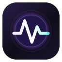
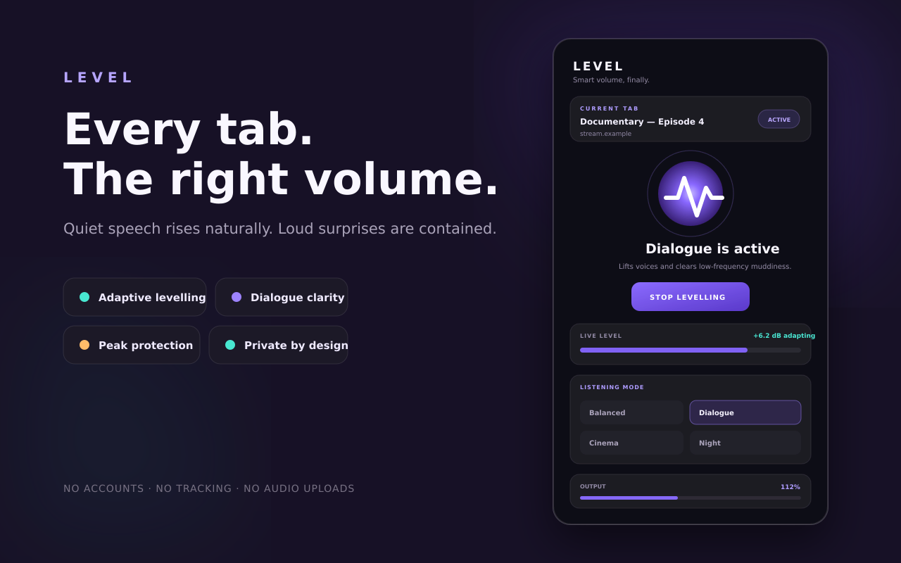
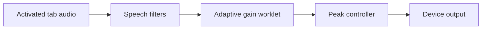

<div align="center">
  
  <h1>Level — Smart Volume for Brave</h1>
  <p><strong>Quiet dialogue up. Sudden blasts down. Every website at the right volume.</strong></p>
  <p>
    
    
    
    
  </p>
</div>



## The volume booster was never the answer

Web audio is inconsistent. Dialogue disappears, advertisements erupt, intros hit harder than the programme, and changing tabs becomes a ritual of reaching for the volume control.

Level is an automatic loudness leveller rather than a blunt booster. It listens only to the tab you activate, raises sustained quiet material gradually, reduces loud changes quickly, shapes speech when requested, catches peaks, and plays the result directly to your device.

| Ordinary volume extension | Level |
|---|---|
| Applies one fixed gain | Adapts continuously to the programme |
| Makes loud surprises even louder | Reduces sudden level jumps |
| Treats speech and effects alike | Provides dedicated dialogue shaping |
| Often optimised for maximum boost | Tuned for intelligibility and consistency |
| May depend on remote services or tracking | Performs all audio processing locally |

## Four tuned listening modes

- **Balanced** — natural levelling for mixed everyday audio.
- **Dialogue** — lifts voices, reduces low-frequency muddiness, and adds presence.
- **Cinema** — controls shocks while preserving more dramatic range and warmth.
- **Night** — keeps whispers clear while containing loud moments more firmly.

Level also includes adjustable output from 50% to 200%, per-website memory, advanced lift and ceiling guardrails, a live loudness meter, audible-tab navigation, a visible active badge, and a `Ctrl+Shift+L` (`⌘⇧L` on macOS) shortcut.

## Private by architecture

Level has no server component.

- Audio is processed transiently inside a hidden extension document on your device.
- Audio is never recorded, uploaded, retained, sold, or shared.
- There are no accounts, advertisements, analytics, telemetry, or tracking pixels.
- Runtime code is packaged with the extension; nothing executable is downloaded remotely.
- Settings and optional website preferences remain in browser extension storage.

Read the complete [privacy policy](docs/PRIVACY.md) and [architecture](docs/ARCHITECTURE.md).

## Install for development

Level requires Brave or another Chromium browser based on Chromium 116 or newer.

1. Download or clone this repository.
2. Run `npm install` and `npm run assets`.
3. Open `brave://extensions`.
4. Enable **Developer mode**.
5. Choose **Load unpacked** and select this repository folder.
6. Open any normal `http` or `https` page playing audio, click Level, then choose **Level this tab**.

Brave requires a direct user action before an extension may capture tab audio. Once activated, Level continues through navigation in that tab until you stop it or close the tab.

## How it works



The processing engine measures block-level RMS energy and sample peaks. Its gain controller uses separate time constants for rising and falling content: quiet material is lifted slowly to avoid room-tone pumping, while loud changes cause much faster reduction. A silence gate returns gain toward unity when meaningful programme content disappears. A final dynamics stage protects the selected output ceiling.

The architecture uses Chromium's Manifest V3 service worker, `tabCapture`, an offscreen document, Web Audio filters, and an `AudioWorkletProcessor`. No content script is injected into websites.

## Permissions, explained

| Permission | Why Level needs it |
|---|---|
| `tabCapture` | Receives audio from the tab you explicitly activate. |
| `offscreen` | Keeps local Web Audio processing alive after the popup closes. |
| `activeTab` | Grants access to the tab on which you invoked Level. |
| `tabs` | Identifies the current/audible tabs and remembers an optional domain preference. |
| `storage` | Saves settings and site profiles in your browser. |

Level requests no broad website host access.

## Development

```bash
npm install
npm run assets
npm run check
npm run package
```

`npm run package` creates the store-uploadable ZIP in `dist/`. Continuous integration regenerates artwork, validates Manifest V3 structure and local-code guarantees, runs unit tests, and packages every change.

See [testing](docs/TESTING.md), [contributing](CONTRIBUTING.md), and the [roadmap](docs/ROADMAP.md).

## Support Level

Level is built independently, with no advertisements, subscriptions, tracking, or feature paywalls. If it makes your browsing better and you feel generous, you can support continued development here:

<a href="https://ko-fi.com/D4P124RWI9" target="_blank"></a>

## Known platform boundaries

- Level cannot run on protected browser pages such as `brave://settings`.
- Every fresh tab must be activated by the user at least once; browser security intentionally prevents silent background capture.
- The extension controls tab audio, not operating-system applications, microphones, HDMI devices, or system-wide sound.
- Output safety still depends on device volume, headphone sensitivity, and listening duration.

## Ownership and licence

Created and maintained by **Conroy1988**.

The code is public for transparency, security review, and contribution. Copyright is reserved; see [LICENSE](LICENSE).

Brave is a trademark of Brave Software, Inc. Level is an independent, unofficial extension and is not affiliated with or endorsed by Brave Software.
