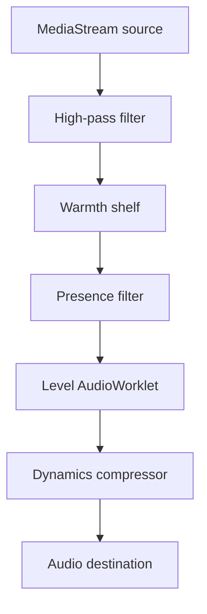

# Level architecture

## Design goals

Level is built around five non-negotiable properties:

1. Audio processing must remain entirely local.
2. Processing must continue after the popup closes and across navigation in an activated tab.
3. Quiet material must rise slowly while dangerous changes are controlled quickly.
4. Browser permissions must map directly to visible product features.
5. Service-worker suspension must not terminate an active audio graph.

## Runtime components

### Popup

The popup is a short-lived control surface. It reads current session state from the service worker, asks the service worker to start or stop a tab, changes modes and output, displays meter broadcasts, and switches to other audible tabs. It never owns the audio stream, because closing the popup would stop a popup-owned stream.

### Manifest V3 service worker

The service worker owns orchestration and policy:

- validates normal web tabs;
- obtains a single-use `tabCapture` media stream ID following a user action;
- creates the offscreen document when required;
- persists active-session metadata in `chrome.storage.session`;
- stores user settings and website profiles in `chrome.storage.local`;
- updates the toolbar badge;
- translates platform errors into useful UI messages.

### Offscreen audio engine

The offscreen document consumes each media stream ID and owns the Web Audio graph. It is independent of the popup and remains available if the service worker is suspended.

For each active tab it creates:

Each tab gets a separate `AudioContext`, stream, controller state, and graph. Closing or stopping one session does not disturb another.

### Adaptive AudioWorklet

The worklet processes 128-frame render blocks on the browser's audio rendering thread. For every block it measures:

- multi-channel RMS energy;
- absolute sample peak;
- smoothed programme level;
- adaptive and total gain.

The shared `AdaptiveGainController` is deterministic and unit-testable outside the browser.

## Control behaviour

The controller starts at unity gain. Its programme meter attacks faster when content becomes louder and releases more slowly when it becomes quiet. It calculates desired gain from the selected target, then clamps that gain to the mode's maximum lift/cut and near-term peak headroom.

Gain movement is asymmetrical:

- **gain reduction is fast**, so a loud transition does not remain excessive;
- **gain increase is slow**, so pauses and background noise are not aggressively pulled forward;
- **silence is gated**, so automatic lift returns to unity when there is no meaningful programme material.

Gain changes are interpolated across every render block. The downstream dynamics compressor provides fast peak containment that the slower adaptive controller deliberately does not attempt to replace.

## Persistence model

| Data | Storage | Lifetime |
|---|---|---|
| General settings | `chrome.storage.local` | Until changed or extension data is cleared |
| Website profiles | `chrome.storage.local` | Until removed by the user |
| Active tab metadata | `chrome.storage.session` | Current browser session only |
| Audio samples | None | Current render block only |
| Meter values | None | Broadcast transiently to an open popup |

## Security boundaries

- No host permissions or content scripts are used.
- No remote code, dynamic script insertion, `eval`, or external runtime dependencies are used.
- The extension-page CSP restricts scripts to the packaged extension.
- Audio capture is requested only for a user-activated tab.
- Only `http` and `https` tabs are accepted by the application layer.
- Website titles and hostnames used in UI are inserted with `textContent`, never HTML.

## Minimum browser version

Level requires Chromium 116 because this is the first version supporting both obtaining a `tabCapture` stream ID from a Manifest V3 service worker and consuming it inside an offscreen document.
